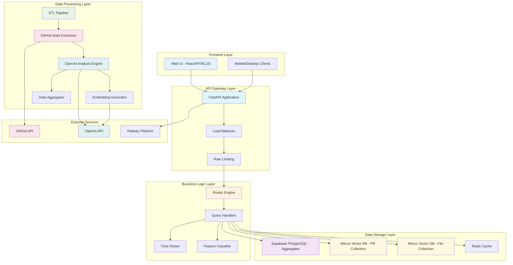
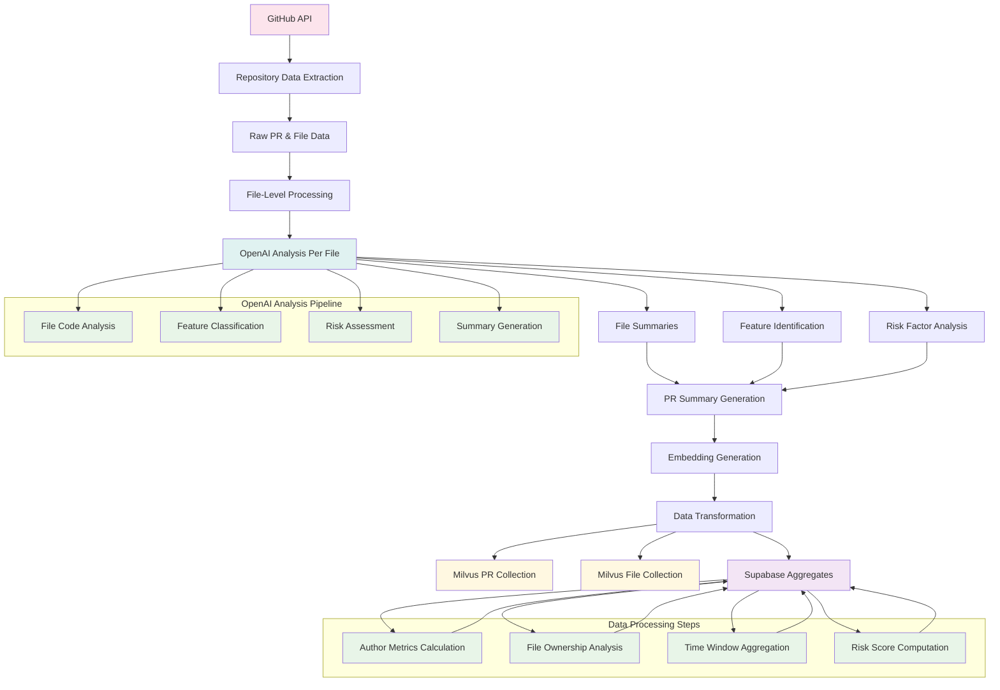

# 🚀 What the Repo — App Overview

**What the Repo** is an intelligent GitHub insights assistant powered by Repo-GPT. It helps developers, managers, and contributors make sense of large repositories by surfacing meaningful summaries, risk signals, and contribution insights directly from pull request (PR) data.

The app integrates **LLM-powered analysis**, **vector search with Milvus**, and **pre-computed metrics stored in Supabase** to answer both natural language queries and provide structured dashboards. It is designed to improve transparency, reduce review overhead, and provide decision-ready insights.

Live App link: Live App link: https://whattherepo-production.up.railway.app/

---
## 🎯 What are we solving
> Engineering managers and developers often struggle to keep track of what features shipped, where risks lie, and how each engineer is contributing. GitHub provides raw data, but it’s scattered and difficult to interpret in real time.

**Problem:**  
How can we build an intelligent system that surfaces repository insights in natural language, highlights shipped features, and provides engineer-specific analytics without sifting through raw Git history?


## 📋 Features

## 🏠 Page 1: Ask Repo-GPT

**Conversational interface** where users can query the repo in plain English.

- **What it does:**
  - Answers ad-hoc queries like:
    - “What changed last week?”
    - “Which file changed the most in the past month?”
    - “What features shipped in the last two weeks?”
  - Supports multi-stage retrieval from Milvus collections (PR-level events + file-level changes).
  - Provides semantic search (via embeddings) for summaries and contextual answers, and direct queries for metrics (e.g., counts, top-N changes).

- **Value:**  
  Lets engineers/managers explore repo changes naturally without needing SQL queries or manual digging into GitHub.

---

## 🚢 Page 2: What Shipped

**Timeline view** of shipped work, focusing on features and significant PRs.

- **What it shows:**
  - Features shipped: all PRs identified as features (via labels, title rules, or unlabeled PRs).
  - PRs merged: list of merged PRs in a time window with summaries.
  - High-risk changes: PRs flagged with risk score ≥7.

- **Value:**  
  Provides stakeholders with a release-style view of “what shipped” without scanning raw GitHub history.  
  Filters out noise (e.g., chores, bugfixes) to highlight meaningful work.

---

## 👤 Page 3: Engineer Profile (Lens)

**Per-engineer contribution profile** within a repo.

- **What it shows (over a selected window: 7/14/30/90 days):**
  - Throughput: PRs submitted vs merged.
  - Review load: number of reviews/comments done.
  - Risk profile: count and percentage of high-risk PRs merged.
  - Contribution heatmap: files changed with ownership percentages.
  - Features added: PRs authored that were merged as features.

- **Value:**  
  Helps engineers reflect on their contributions.  
  Gives managers visibility into ownership, risk exposure, and impact per contributor.  
  Supports mentorship, recognition, and workload balancing.


## 🏗️ High-Level System Architecture



##  Data Sources

- **GitHub API** (primary raw data)
- **Milvus** (semantic search)
- **Supabase** (structured metrics storage)

## Tech Stack

- **Backend:** FastAPI (lightweight, async, Python ecosystem)
- **Vector Store:** Milvus (handles embeddings, fast similarity search)
- **Database:** Supabase/Postgres (good for structured aggregations, easy UI/API, integrates with auth)
- **LLM:** OpenAI (for semantic search, summaries, risk scoring)
- **Frontend:** React + Tailwind (clean, fast UI)

## Data Flow Architecture

### ETL Pipeline Flow


# Challenge that 'WhatTheRepo' solved
It’s inherently harder to make Ask-Repo GPT do both semantic and scalar search than to build a “semantic doc search” app. You’re mixing two very different retrieval worlds:

- **Semantic:** Free-text similarity over unstructured text (PR titles, bodies, summaries, diffs).
- **Scalar/Relational:** Exact filters, grouping, sorting, and aggregation over structured facts (time windows, authors, lines changed, risk, labels).

Below is why it’s hard here, plus patterns that make it tractable.

---

## 🚩 Why This Is Harder Than “Semantic Docs”

### 1. Heterogeneous Objects & Multi-Granularity

- **Doc search:** One object type (documents).
- **Repo Q&A:** At least two object types (PRs and files), with hierarchical relations (files → PR → repo).
- A single question may start file-level (“risky SQL changes”) and need PR-level presentation and de-duplication. That means grouping and roll-ups—not a thing in pure vector search.

---

### 2. Structured Constraints That Matter to Correctness

- Queries like “last week,” “by author X,” “top file by lines changed” are hard constraints.
- Vector search won’t honor those; you must slice by scalars first (time/author/repo) and only then rank semantically.
- Getting the order right (pre-filter vs post-filter) is critical to precision/latency.

---

### 3. Aggregations & Rankings Beyond Cosine Similarity

- Questions like “file that changed most last week” require `SUM(lines_changed) GROUP BY file_id` and sorting—operations vector DBs don’t do natively.
- If you fetch candidates and aggregate client-side, you must handle:
  - Potentially large result sets (performance).
  - Correctness (e.g., do you combine multiple file rows across PRs?).

---

### 4. Conflicting Signals You Must Fuse

- Relevance = f(semantic score, recency, risk, lines_changed, author filters, labels).
- You need a scoring fusion (e.g., weighted sum or rank-SVM-like scheme).
- Document search rarely needs to blend this many orthogonal signals.

---

### 5. Embedding Construction Is Harder for Code Changes

- What do you embed: title? body? diff? path? language? file summary? PR summary?
- For files, diffs are noisy; for PRs, bodies are sparse.
- Picking which fields to embed and how to concatenate them changes retrieval quality a lot. (In doc search, your “document text” is clear.)

---

### 6. Query Understanding / Routing

- You must classify the user ask into direct (scalar), hybrid (scalar slice + vector rank), or vector (“explain why risky”).
- Pure doc search can route everything to vector without losing correctness; here that would give wrong answers for “top/most/count in window”.

---

### 7. Latency & Pagination Pressure

- Scalar filters + client-side aggregation + vector search + de-dup + re-ranking can easily exceed your latency budget.
- A doc search typically does one vector call.

---

### 8. Evaluation Is Trickier

- Ground truth for “features shipped last two weeks” is count/identity (exact).
- Ground truth for “auth work last month” is fuzzy/semantic.
- You need two kinds of tests and blended success criteria (precision@k and exactness on numeric answers).

---

## 🛠️ Patterns That Make It Work

### Scalar-First Slicing, Then Vector (Hybrid)

- Apply strict filters in Milvus expr (or your store) for time, repo, author, label to get a candidate set.
- Run vector search within that slice.
- Fuse scores: `final = α·cosine + β·recency + γ·risk + δ·log(lines_changed)`. Tune α,β,γ,δ.

---

### Precompute the Heavy Scalars

- Daily rollups and window snapshots (PR counts, high-risk counts, lines changed) to answer “count/top” instantly.
- Keep vector for ranking and explanations only.

---

### Model Two Granularities Explicitly

- `pr_index` for PR-level semantic search.
- `file_changes` for file-level semantic search (with lines_changed, language, risk_score_file as scalars).
- After file search, group to PRs for display.

---
### Fielded Embeddings (Better Signal)

- **PR:** title + body[:N] + "Summary:" + pr_summary + "Files:" + top_paths.
- **File:** PATH + LANGUAGE + LLM file summary + DIFF SNIPPET.
- Keep them short and consistent; don’t dump entire diffs (noise).

---
### Deterministic Router

- “count/top/list + timeframe” → direct scalar.
- “topic + timeframe” → hybrid.
- “why/explain” → vector (with time prefilter).
- Only fall back to an LLM router when ambiguous.

## 📚 Documentation

- **[Architecture](./docs/ARCHITECTURE.md)** - Complete system design and components
- **[API Reference](./docs/API.md)** - Endpoint documentation and examples
- **[Database Schema](./docs/SCHEMA.md)** - Table and collection definitions
- **[Data Quality](./docs/DATA_CLEANING.md)** - Data cleaning and normalization rules
- **[Operations](./docs/RUNBOOK.md)** - Deployment and troubleshooting guide
- **[System Diagrams](./docs/DIAGRAMS.md)** - Visual architecture diagrams
- **[Repository Inventory](./docs/INVENTORY.md)** - Codebase structure and dependencies

## 🏗️ Project Structure

```
what_the_repo/
├── main.py                    # FastAPI web application
├── requirements.txt           # Railway deployment dependencies
├── runtime.txt               # Python version specification
├── Procfile                 # Railway start command
├── railway.json             # Railway configuration
├── RAILWAY_DEPLOYMENT.md    # Railway deployment guide
├── test_railway_deployment.py # Railway deployment testing
├── .gitignore               # Git ignore file
├── README.md                # This file
│
├── git_data_download/       # GitHub PR data collection
│   ├── requirements.txt     # GitHub API and data processing dependencies
│   └── README.md           # Data collection documentation
│
├── milvus_data_load/        # Vector database operations
│   ├── requirements.txt     # Milvus and embedding dependencies
│   └── README.md           # Vector database documentation
│
├── postgres_data_load/      # PostgreSQL analytics processing
│   ├── requirements.txt     # Database and analytics dependencies
│   └── README.md           # Analytics documentation
│
├── static/                  # Web assets and static files
│   ├── requirements.txt     # Static file serving dependencies
│   └── README.md           # Static files documentation
│
└── tests/                   # Test files and utilities
    └── README.md           # Testing documentation
```

## 🚀 Quick Start

### Railway Deployment (Recommended)

1. **Deploy to Railway**:
   ```bash
   # Follow RAILWAY_DEPLOYMENT.md for complete setup
   # 1. Connect GitHub repo to Railway
   # 2. Configure environment variables
   # 3. Deploy automatically
   ```

2. **Test Deployment**:
   ```bash
   python test_railway_deployment.py
   ```

### Local Development

1. **Install main dependencies**:
   ```bash
   pip install -r requirements.txt
   ```

2. **Install subfolder dependencies** (as needed):
   ```bash
   # For GitHub data collection
   pip install -r git_data_download/requirements.txt
   
   # For vector database operations
   pip install -r milvus_data_load/requirements.txt
   
   # For PostgreSQL analytics
   pip install -r postgres_data_load/requirements.txt
   
   # For static file serving
   pip install -r static/requirements.txt
   ```

3. **Run the application**:
   ```bash
   python main.py
   ```

## 📦 Dependency Structure

### Main Application (`requirements.txt`)
- **Core**: FastAPI, uvicorn, pydantic
- **Database**: PostgreSQL, Supabase, Milvus
- **AI**: OpenAI API
- **Utilities**: HTTP requests, logging, environment variables

### Git Data Download (`git_data_download/requirements.txt`)
- **GitHub API**: PyGithub
- **Data Processing**: pandas, numpy
- **AI Analysis**: OpenAI
- **Utilities**: HTTP requests, date handling, JSON processing

### Milvus Data Load (`milvus_data_load/requirements.txt`)
- **Vector Database**: pymilvus
- **Embeddings**: sentence-transformers, OpenAI
- **Data Processing**: pandas, numpy
- **Database**: PostgreSQL, Supabase

### Postgres Data Load (`postgres_data_load/requirements.txt`)
- **Database**: PostgreSQL, Supabase, SQLAlchemy
- **Data Processing**: pandas, numpy
- **AI Analysis**: OpenAI
- **Vector Operations**: pymilvus

### Static Files (`static/requirements.txt`)
- **Web Framework**: FastAPI
- **Utilities**: Environment variables
- **Development**: Testing and formatting tools

## 🔧 Environment Variables

### Required for Main Application
```bash
# Milvus Configuration
MILVUS_URL=your_milvus_url
MILVUS_TOKEN=your_milvus_token
COLLECTION_NAME=your_collection_name

# OpenAI Configuration
OPENAI_API_KEY=your_openai_api_key

# Supabase Configuration
SUPABASE_URL=your_supabase_url
SUPABASE_SERVICE_ROLE_KEY=your_supabase_service_role_key
SUPABASE_DB_URL=your_supabase_db_url
```

### Additional for Data Processing
```bash
# GitHub API (for git_data_download)
GITHUB_TOKEN=your_github_token

# Database (for postgres_data_load)
DATABASE_URL=your_database_url
```

## 📡 API Endpoints

| Endpoint | Method | Description |
|----------|--------|-------------|
| `/` | GET | Home page with navigation |
| `/health` | GET | Health check and status |
| `/engineering-lens` | GET | Engineer Lens analytics page |
| `/what-shipped` | GET | What Shipped tracking page |
| `/api/engineers` | GET | Engineers data API |
| `/api/engineer-metrics` | GET | Engineer metrics API |
| `/api/what-shipped-data` | GET | What shipped data API |
| `/api/what-shipped-summary` | GET | What shipped summary API |
| `/api/what-shipped-authors` | GET | What shipped authors API |
| `/docs` | GET | Interactive API documentation |

## 🧪 Testing

### Railway Deployment Testing
```bash
python test_railway_deployment.py
```

### Local Testing
```bash
# Test main application
python -m pytest tests/

# Test specific modules
python -m pytest git_data_download/tests/
python -m pytest milvus_data_load/tests/
python -m pytest postgres_data_load/tests/
```

## 📊 Data Pipeline

1. **GitHub Data Collection** (`git_data_download/`)
   - Collect PR data from GitHub API
   - Process and enrich with AI analysis
   - Store in structured format

2. **Vector Database Loading** (`milvus_data_load/`)
   - Generate embeddings for PR content
   - Load into Milvus for semantic search
   - Index for fast retrieval

3. **Analytics Processing** (`postgres_data_load/`)
   - Process data for analytics dashboards
   - Generate Engineer Lens metrics
   - Create What Shipped summaries

4. **Web Application** (`main.py`)
   - Serve web interface
   - Provide API endpoints
   - Handle user interactions

## 🔍 Troubleshooting

### Common Issues

1. **Missing Dependencies**:
   ```bash
   # Install all subfolder dependencies
   pip install -r */requirements.txt
   ```

2. **Environment Variables**:
   ```bash
   # Check environment setup
   python -c "import os; print('MILVUS_URL:', os.getenv('MILVUS_URL'))"
   ```

3. **Database Connections**:
   ```bash
   # Test database connectivity
   python -c "import psycopg2; print('PostgreSQL available')"
   ```

### Debug Commands

```bash
# Check Python version
python --version

# Verify dependencies
pip list

# Test health endpoint
curl http://localhost:8000/health

# Check logs
tail -f logs/app.log
```

## 📈 Performance

- **Cold Start**: ~2-5 seconds (Railway)
- **Response Time**: <100ms for simple endpoints
- **Memory Usage**: ~50-100MB
- **Vector Search**: <500ms for semantic queries

## 🔐 Security

- Environment variables for all secrets
- Input validation with Pydantic
- CORS configuration for web access
- Database connection pooling
- Rate limiting on API endpoints

## 📝 License

This project is open source and available under the MIT License.

## 🤝 Contributing

1. Fork the repository
2. Create a feature branch
3. Install dependencies for your module
4. Make your changes
5. Test thoroughly
6. Submit a pull request

## 📞 Support

- **Documentation**: Check individual README files in subfolders
- **Issues**: Create GitHub issues for bugs or feature requests
- **Deployment**: Follow `RAILWAY_DEPLOYMENT.md` for deployment help

---

**Happy analyzing! 🚀** 