# What the Repo - System Diagrams

**How to read this doc**: This document contains Mermaid diagrams that visualize the What the Repo system architecture, data flow, and database schemas. Each diagram focuses on a specific aspect of the system.

## System Context Diagram

Shows the high-level system architecture and external dependencies.

```mermaid
graph TB
    User[👤 User] --> UI[🌐 Web UI]
    UI --> API[🚀 FastAPI App]
    
    API --> Milvus[(🔍 Milvus Vector DB)]
    API --> Supabase[(🗄️ Supabase PostgreSQL)]
    API --> OpenAI[🤖 OpenAI API]
    
    ETL[⚙️ ETL Pipeline] --> GitHub[📦 GitHub API]
    ETL --> Milvus
    ETL --> Supabase
    
    subgraph "External Services"
        GitHub
        OpenAI
    end
    
    subgraph "Data Storage"
        Milvus
        Supabase
    end
    
    subgraph "Application Layer"
        UI
        API
        ETL
    end
```

## Data Flow ETL

Illustrates the complete ETL pipeline from GitHub to analytics.

## Request Routing

Shows how queries are routed to different handlers based on content analysis.

## Sequence Diagram: "What features shipped last two weeks"

Shows the interaction flow for a feature query.

## Sequence Diagram: "File that changed most last week"

Shows the interaction flow for a file analysis query.

## ERD: Milvus Logical Schema

Shows the structure of Milvus collections.

## ERD: Supabase Tables

Shows the structure of PostgreSQL tables.

## Data Processing Flow

Shows how data moves through the system.

## Query Processing Flow

Shows how different query types are processed.

