# Router System Explanation

## Overview

The router system in WhatTheRepo is an **intelligent query classification and routing engine** that analyzes natural language queries and determines the optimal search strategy. It acts as the brain of the search system, making intelligent decisions about how to process each user query to provide the most relevant and efficient results.

## Architecture

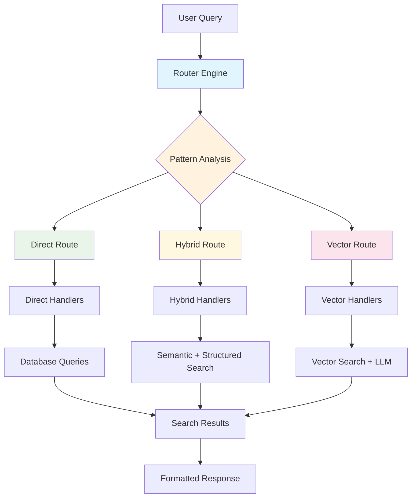

## Core Components

### 1. Main Router Function (`route_query`)

The primary entry point that processes all queries:

```python
def route_query(q: str) -> Dict[str, Any]:
    """
    Route a query to the appropriate search strategy.
    
    Returns:
        Dictionary with routing information including:
        - route: "direct", "hybrid", or "vector"
        - object: "prs", "features", or "files"
        - metric: "list", "top", "count", or "explain"
        - semantic_terms: List of semantic terms for hybrid/vector search
    """
```

### 2. Route Determination Functions

- `determine_direct_route()` - Handles structured, specific queries
- `determine_hybrid_route()` - Handles topic-based queries with semantic search
- `determine_vector_route()` - Handles explanatory and analytical queries

### 3. Helper Functions

- `extract_semantic_terms()` - Extracts technical terms from queries
- `is_explanation_query()` - Identifies explanation requests
- `is_count_query()` - Identifies count requests
- `is_top_query()` - Identifies top/most requests

## Detailed Flow Diagram

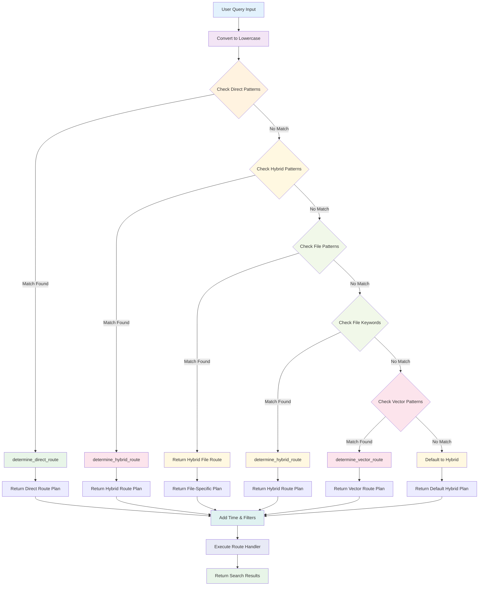

## Route Types

### 1. Direct Route

**Purpose**: Handle specific, structured queries that can be answered with direct database queries.

**Patterns Recognized**:
```python
direct_patterns = [
    r'\b(count|top|most|list|merged)\b',
    r'features?\s+shipped',
    r'what\s+was\s+shipped',
    r'file\s+that\s+changed',
    r'how\s+many',
    r'pr\s+\d+',
    r'\b(riskiest|high\s+risk|most\s+risky)\b',
    r'\b(largest|biggest|most\s+changes)\b'
]
```

**Example Queries**:
- "What was shipped in the last two weeks?"
- "Show me the top 10 riskiest PRs"
- "Count total PRs merged this month"
- "Find changes by author alice"
- "PR #123 summary"

**Flow Diagram**:
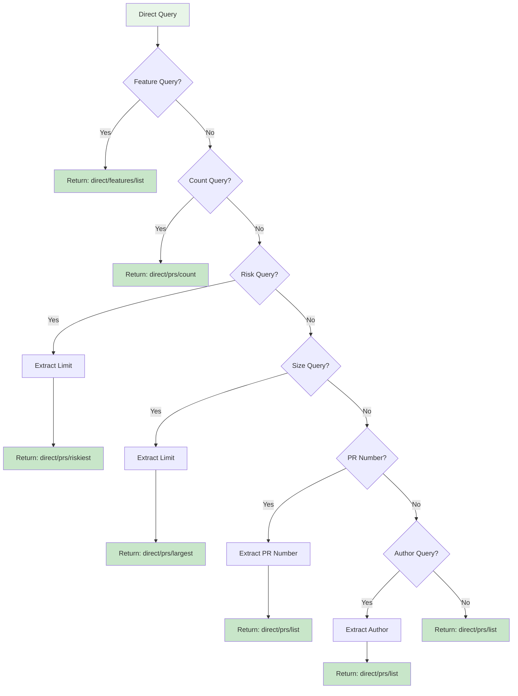

### 2. Hybrid Route

**Purpose**: Handle topic-based queries that combine semantic search with structured filters.

**Patterns Recognized**:
```python
hybrid_patterns = [
    r'\b(auth|authentication|authorization)\b',
    r'\b(payment|billing|invoice)\b',
    r'\b(pipeline|ci|cd|deploy)\b',
    r'\b(security|vulnerability|risk)\b',
    r'\b(database|sql|query)\b',
    r'\b(api|endpoint|route)\b',
    r'\b(ui|ux|frontend|backend)\b',
    r'\b(test|testing|tested)\b',
    r'\b(performance|optimization|speed)\b',
    r'\b(error|bug|fix|issue)\b'
]
```

**Example Queries**:
- "Find authentication changes"
- "Show me database schema changes"
- "What API changes were made?"
- "Find performance optimizations"

**Flow Diagram**:
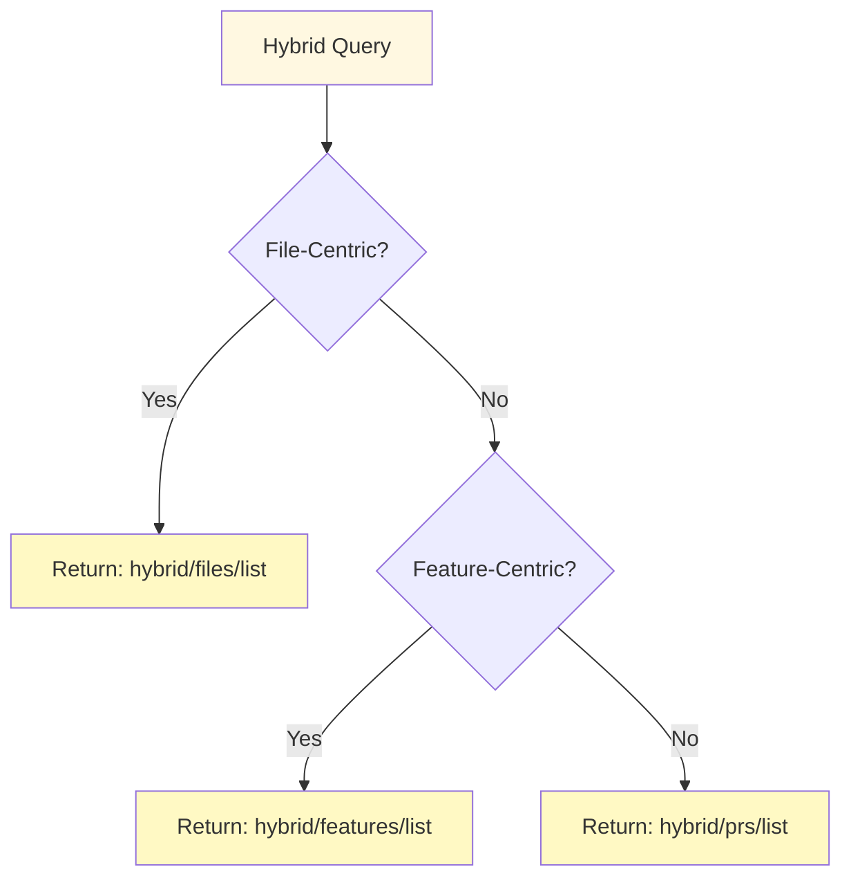

### 3. Vector Route

**Purpose**: Handle explanatory and analytical queries that require semantic understanding.

**Patterns Recognized**:
```python
vector_patterns = [
    r'\bwhy\b',
    r'\bexplain\b',
    r'\bhow\s+does\b',
    r'\bwhat\s+is\b',
    r'\brisky\s+because\b',
    r'\bshow\s+me\b',
    r'\btell\s+me\b',
    r'\bdescribe\b',
    r'\bunderstand\b',
    r'\bstreaming\s+features?\b',
    r'\bcomplex\s+changes?\b',
    r'\bimpact\s+of\b'
]
```

**Example Queries**:
- "Why is this PR risky?"
- "Explain the impact of these changes"
- "How does this authentication system work?"
- "Tell me about the streaming features"

**Flow Diagram**:
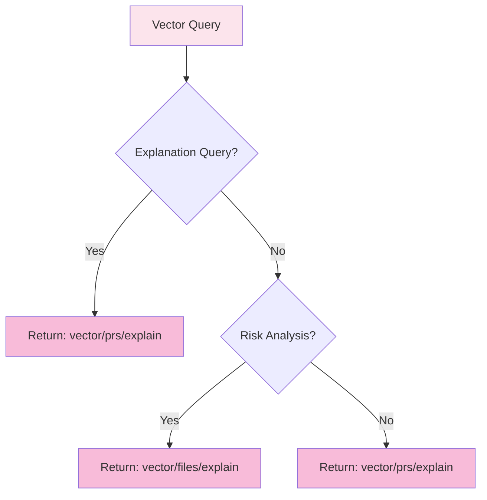

## File-Specific Routing

Special handling for file-specific queries:

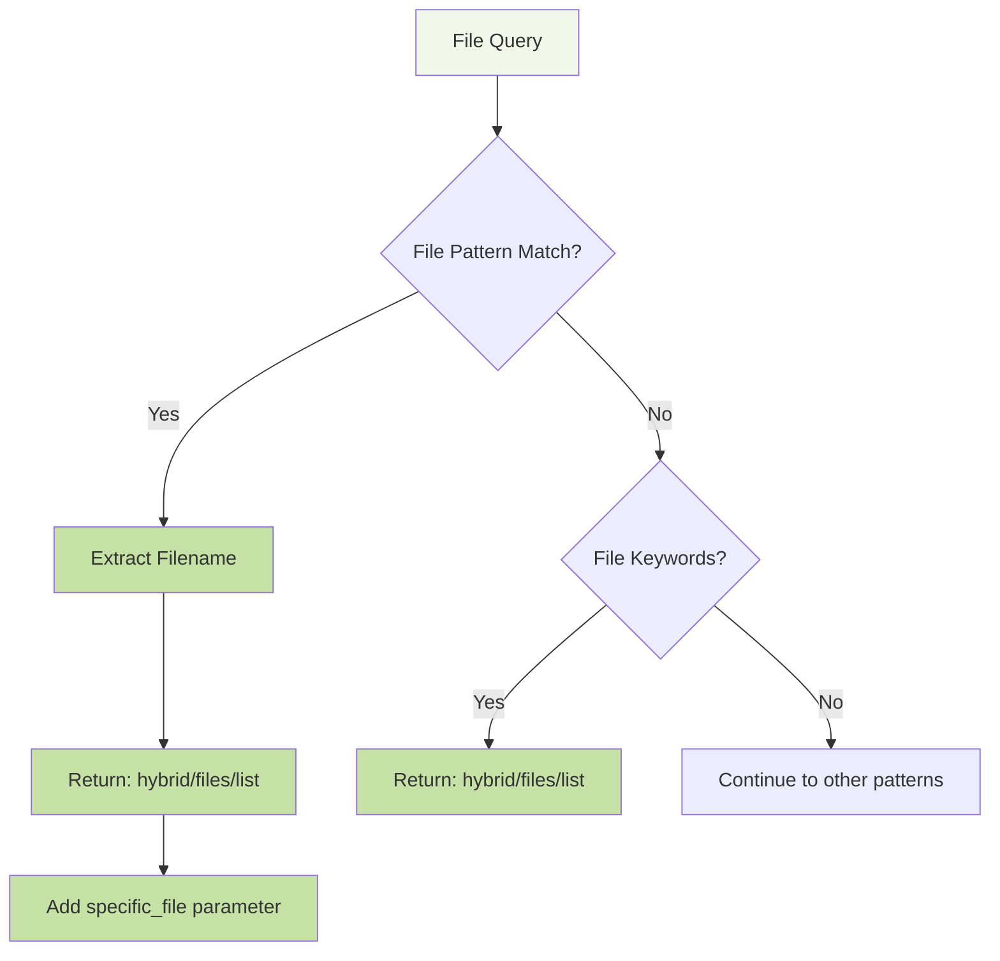

**Patterns**:
```python
file_patterns = [
    r'show\s+changes?\s+in\s+([a-zA-Z0-9_.-]+)',
    r'changes?\s+to\s+([a-zA-Z0-9_.-]+)',
    r'changes?\s+in\s+([a-zA-Z0-9_.-]+)',
    r'file\s+([a-zA-Z0-9_.-]+)',
    r'([a-zA-Z0-9_.-]+\.(py|js|java|cpp|c|h|ts|jsx|tsx|html|css|sql|json|yaml|yml|md|txt))'
]
```

## Parameter Extraction

The router automatically extracts various parameters from queries:

### Limit Extraction
```python
# From: "Show me the top 5 riskiest PRs"
top_match = re.search(r'top\s+(\d+)', query_lower)
limit = int(top_match.group(1)) if top_match else 20
# Result: limit = 5
```

### Author Extraction
```python
# From: "Changes made by john_doe"
author_match = re.search(r'changes?\s+(made|done)\s+by\s+([a-zA-Z0-9_-]+)', query_lower)
author = author_match.group(2) if author_match else None
# Result: author = "john_doe"
```

### PR Number Extraction
```python
# From: "PR #123" or "PR 456"
pr_match = re.search(r'pr\s+(?:#\s*)?(\d+)', query_lower)
pr_number = int(pr_match.group(1)) if pr_match else None
# Result: pr_number = 123 or 456
```

## Semantic Terms Extraction

The router extracts technical terms for hybrid and vector searches:

```python
technical_terms = [
    'auth', 'authentication', 'authorization', 'login', 'logout',
    'payment', 'billing', 'invoice', 'transaction', 'money',
    'pipeline', 'ci', 'cd', 'deploy', 'deployment', 'build',
    'security', 'vulnerability', 'risk', 'secure', 'encryption',
    'database', 'sql', 'query', 'schema', 'migration', 'table',
    'api', 'endpoint', 'route', 'rest', 'graphql', 'webhook',
    'ui', 'ux', 'frontend', 'backend', 'interface', 'component',
    'test', 'testing', 'tested', 'unit', 'integration', 'e2e',
    'performance', 'optimization', 'speed', 'fast', 'slow',
    'error', 'bug', 'fix', 'issue', 'problem', 'crash',
    'streaming', 'real-time', 'async', 'concurrent', 'parallel',
    'complex', 'complicated', 'refactor', 'cleanup', 'simplify'
]
```

## Integration with Main Application

### Search Endpoint Integration

```python
@app.post("/search")
async def search_prs(request: SearchRequest):
    # Step 1: Route the query
    plan = route_query(request.query)
    
    # Step 2: Parse time window
    start, end = parse_time(request.query)
    plan["time"] = {"start": start, "end": end}
    plan["filters"] = {"repo": request.repo_name}
    
    # Step 3: Execute based on route
    if plan["route"] == "direct":
        if plan["object"] == "features":
            data = direct_features_list(request.repo_name, start, end, None, request.limit)
        elif plan["metric"] == "riskiest":
            data = direct_prs_list(request.repo_name, start, end, sort_by_riskiest=True)
            
    elif plan["route"] == "hybrid":
        if plan["object"] == "features":
            data = hybrid_features(request.repo_name, start, end, terms, request.limit)
            
    elif plan["route"] == "vector":
        data = vector_explanation(request.repo_name, start, end, terms, request.limit)
```

### Handler Mapping

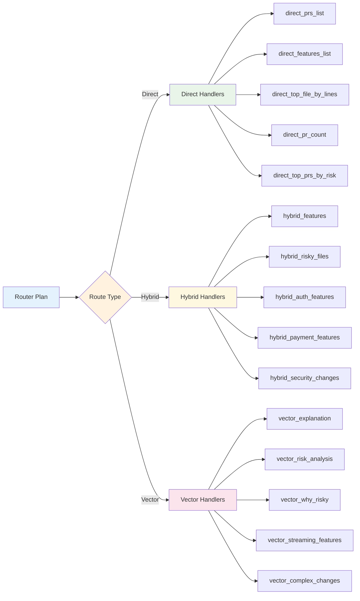

## Example Query Processing

### Example 1: Direct Route

**Input Query**: `"Show me the top 10 riskiest PRs from last month"`

**Processing Flow**:
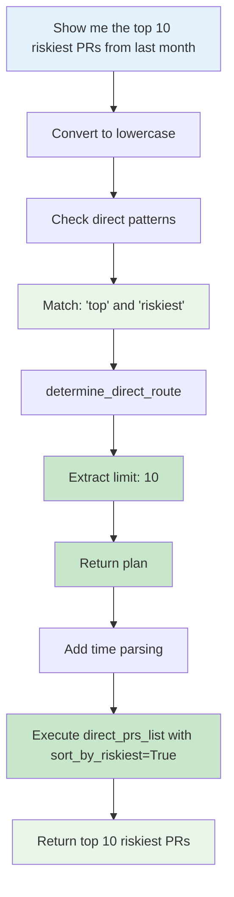

**Router Output**:
```python
{
    "route": "direct",
    "object": "prs",
    "metric": "riskiest",
    "limit": 10,
    "semantic_terms": [],
    "time": {"start": timestamp, "end": timestamp}
}
```

### Example 2: Hybrid Route

**Input Query**: `"Find authentication changes in the last week"`

**Processing Flow**:
```mermaid
flowchart TD
    A["Find authentication changes in the last week"] --> B[Convert to lowercase]
    B --> C[Check direct patterns - No match]
    C --> D[Check hybrid patterns]
    D --> E[Match: 'auth']
    E --> F[determine_hybrid_route]
    F --> G[Extract semantic terms: ['auth']]
    G --> H[Return plan]
    H --> I[Add time parsing]
    I --> J[Execute hybrid_auth_features]
    J --> K[Return authentication-related PRs]
    
    style A fill:#e3f2fd
    style E fill:#fff8e1
    style G fill:#fff9c4
    style H fill:#fff9c4
    style J fill:#fff9c4
    style K fill:#fff8e1
```

**Router Output**:
```python
{
    "route": "hybrid",
    "object": "features",
    "metric": "list",
    "semantic_terms": ["auth"],
    "time": {"start": timestamp, "end": timestamp}
}
```

### Example 3: Vector Route

**Input Query**: `"Why is this PR risky?"`

**Processing Flow**:
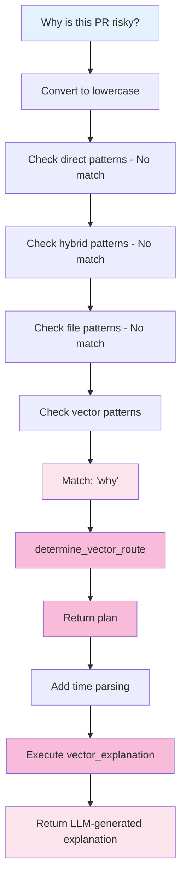

**Router Output**:
```python
{
    "route": "vector",
    "object": "prs",
    "metric": "explain",
    "semantic_terms": ["Why is this PR risky?"],
    "time": {"start": timestamp, "end": timestamp}
}
```

## Performance Characteristics

### Pattern Matching Efficiency

The router uses **priority-based pattern matching** to ensure optimal performance:

1. **Direct patterns** (fastest) - Simple regex matches for structured queries
2. **Hybrid patterns** (medium) - Topic-based matching with semantic terms
3. **Vector patterns** (slowest) - Complex analysis requiring LLM processing

### Caching Strategy

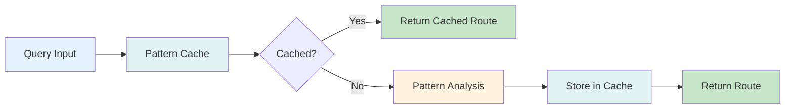

## Error Handling

### Fallback Strategy

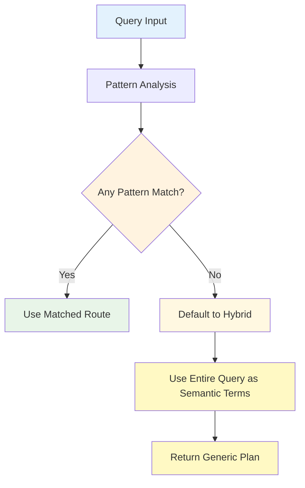

### Error Recovery

1. **Invalid Parameters**: Default to safe values (limit=20, no specific filters)
2. **Pattern Failures**: Fallback to hybrid route with full query
3. **Time Parsing Errors**: Use default time window (last 30 days)
4. **Handler Failures**: Return empty results with error message

## Debugging and Logging

### Router Debug Output

```python
print(f"🎯 Router Results:")
print(f"   Query: '{q}'")
print(f"   Route: {result['route']}")
print(f"   Object: {result['object']}")
print(f"   Metric: {result['metric']}")
print(f"   Semantic terms: {result.get('semantic_terms', [])}")
```

### Example Debug Output

```
🎯 Router Results:
   Query: 'Show me the top 5 riskiest PRs'
   Route: direct
   Object: prs
   Metric: riskiest
   Semantic terms: []
```

## Extensibility

### Adding New Patterns

To add new routing patterns:

1. **Add to pattern lists**:
```python
direct_patterns.append(r'\bnew_pattern\b')
hybrid_patterns.append(r'\bnew_topic\b')
vector_patterns.append(r'\bnew_analysis\b')
```

2. **Update determination functions**:
```python
def determine_direct_route(query: str) -> Dict[str, Any]:
    # Add new pattern handling
    if re.search(r'new_pattern', query_lower):
        return {
            "route": "direct",
            "object": "prs",
            "metric": "new_metric",
            "semantic_terms": []
        }
```

3. **Add corresponding handlers**:
```python
# In direct_handlers.py
def direct_new_metric(repo_name, start, end, limit):
    # Implementation for new metric
    pass
```

### Adding New Route Types

To add a new route type:

1. **Define new patterns**
2. **Create determination function**
3. **Add to main router logic**
4. **Create corresponding handlers**
5. **Update main application integration**

## Best Practices

### Pattern Design

1. **Use word boundaries** (`\b`) to avoid partial matches
2. **Order patterns by specificity** (most specific first)
3. **Use case-insensitive matching** for user-friendly queries
4. **Include variations** (singular/plural, synonyms)

### Performance Optimization

1. **Cache frequently used patterns**
2. **Use compiled regex patterns** for repeated matching
3. **Limit semantic terms extraction** to relevant domains
4. **Implement early exit** for obvious matches

### Maintainability

1. **Document pattern purposes** with comments
2. **Group related patterns** logically
3. **Use descriptive variable names**
4. **Add comprehensive logging** for debugging

## Conclusion

The router system provides a sophisticated, extensible foundation for intelligent query processing in WhatTheRepo. By combining pattern matching, parameter extraction, and semantic analysis, it ensures that each user query is processed by the most appropriate search strategy, optimizing both performance and result relevance.

The modular design allows for easy extension and maintenance, while the comprehensive logging and error handling ensure robust operation in production environments.
