# WhatTheRepo System Architecture

## Overview

WhatTheRepo is a sophisticated GitHub PR analysis and insights platform that combines multiple data sources, intelligent routing, and AI-powered analysis to provide comprehensive insights into code changes and developer productivity.

## High-Level System Architecture

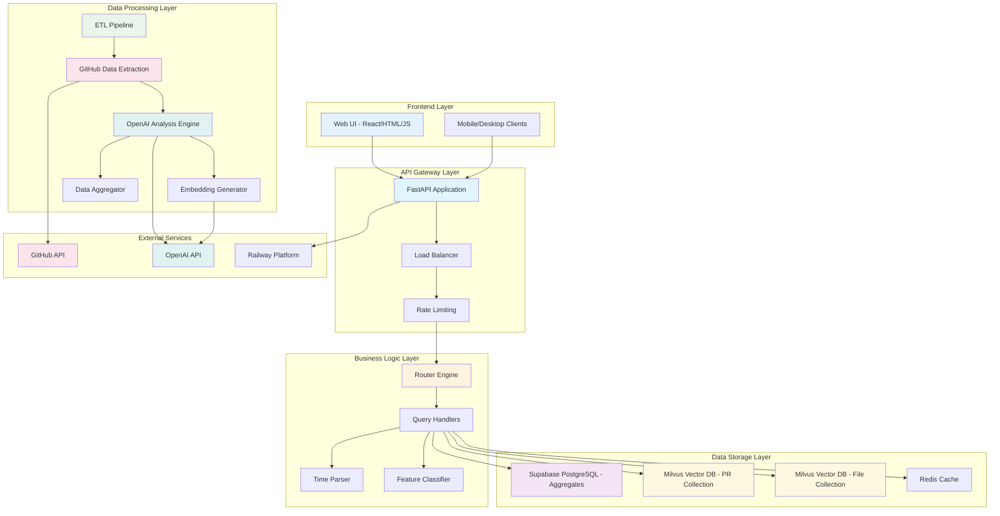
```mermaid
graph TB
    subgraph "Frontend Layer"
        A[Web UI - React/HTML/JS]
        B[Mobile/Desktop Clients]
    end
    
    subgraph "API Gateway Layer"
        C[FastAPI Application]
        D[Load Balancer]
        E[Rate Limiting]
    end
    
    subgraph "Business Logic Layer"
        F[Router Engine]
        G[Query Handlers]
        H[Time Parser]
        I[Feature Classifier]
    end
    
    subgraph "Data Processing Layer"
        J[ETL Pipeline]
        K[GitHub Data Extraction]
        L[OpenAI Analysis Engine]
        M[Embedding Generator]
        N[Data Aggregator]
    end
    
    subgraph "Data Storage Layer"
        O[Supabase PostgreSQL - Aggregates]
        P[Milvus Vector DB - PR Collection]
        Q[Milvus Vector DB - File Collection]
        R[Redis Cache]
    end
    
    subgraph "External Services"
        S[GitHub API]
        T[OpenAI API]
        U[Railway Platform]
    end
    
    A --> C
    B --> C
    C --> D
    D --> E
    E --> F
    F --> G
    G --> H
    G --> I
    
    J --> K
    K --> L
    L --> M
    L --> N
    
    G --> O
    G --> P
    G --> Q
    G --> R
    
    K --> S
    L --> T
    M --> T
    
    C --> U
    
    style A fill:#e3f2fd
    style C fill:#e1f5fe
    style F fill:#fff3e0
    style J fill:#e8f5e8
    style K fill:#fce4ec
    style L fill:#e0f2f1
    style O fill:#f3e5f5
    style P fill:#fff8e1
    style Q fill:#fff8e1
    style S fill:#fce4ec
    style T fill:#e0f2f1
```

## Component Architecture

### 1. Frontend Components

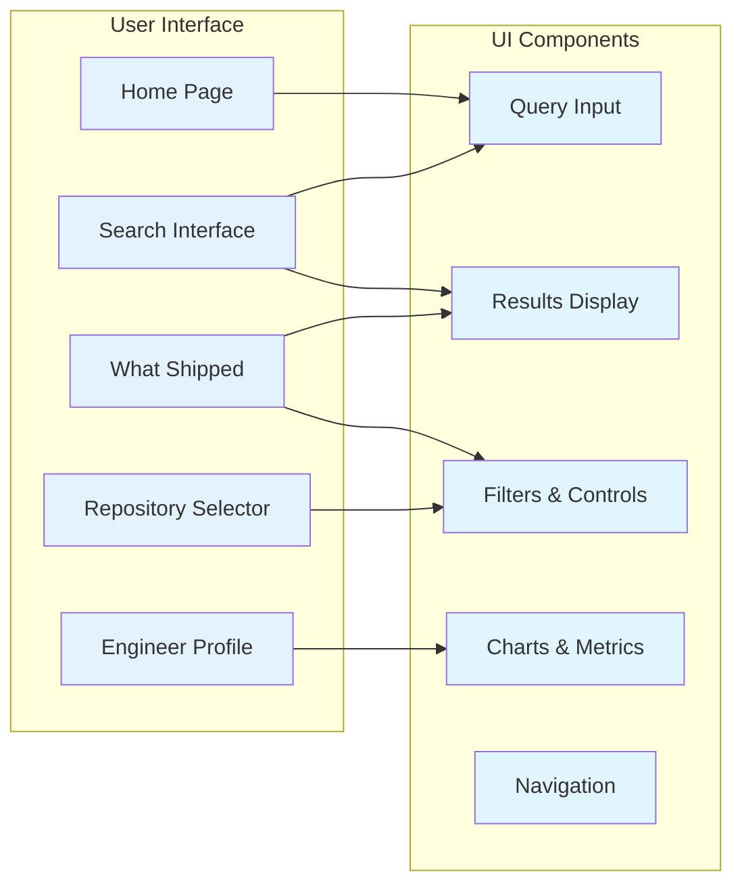
```mermaid
graph LR
    subgraph "User Interface"
        A[Home Page]
        B[Search Interface]
        C[Engineer Profile]
        D[What Shipped]
        E[Repository Selector]
    end
    
    subgraph "UI Components"
        F[Query Input]
        G[Results Display]
        H[Filters & Controls]
        I[Charts & Metrics]
        J[Navigation]
    end
    
    A --> F
    B --> F
    B --> G
    C --> I
    D --> G
    D --> H
    E --> H
    
    style A fill:#e3f2fd
    style B fill:#e3f2fd
    style C fill:#e3f2fd
    style D fill:#e3f2fd
    style E fill:#e3f2fd
    style F fill:#e1f5fe
    style G fill:#e1f5fe
    style H fill:#e1f5fe
    style I fill:#e1f5fe
    style J fill:#e1f5fe
```

### 2. API Layer Architecture

```mermaid
graph TB
    subgraph "FastAPI Application"
        A[Main App Router]
        B[Middleware Stack]
        C[Error Handlers]
        D[Authentication]
    end
    
    subgraph "API Endpoints"
        E[/search - Intelligent Search]
        F[/api/engineer-metrics - Engineer Data]
        G[/api/what-shipped - PR Analysis]
        H[/api/repositories - Repo List]
        I[/ask - Q&A Interface]
    end
    
    subgraph "Request Processing"
        J[Request Validation]
        K[Query Routing]
        L[Response Formatting]
        M[Error Handling]
    end
    
    A --> B
    B --> C
    B --> D
    
    A --> E
    A --> F
    A --> G
    A --> H
    A --> I
    
    E --> J
    F --> J
    G --> J
    H --> J
    I --> J
    
    J --> K
    K --> L
    L --> M
    
    style A fill:#e1f5fe
    style E fill:#e8f5e8
    style F fill:#e8f5e8
    style G fill:#e8f5e8
    style H fill:#e8f5e8
    style I fill:#e8f5e8
    style J fill:#fff3e0
    style K fill:#fff3e0
    style L fill:#fff3e0
    style M fill:#fff3e0
```

## Data Flow Architecture

### 1. ETL Pipeline Flow (Updated)

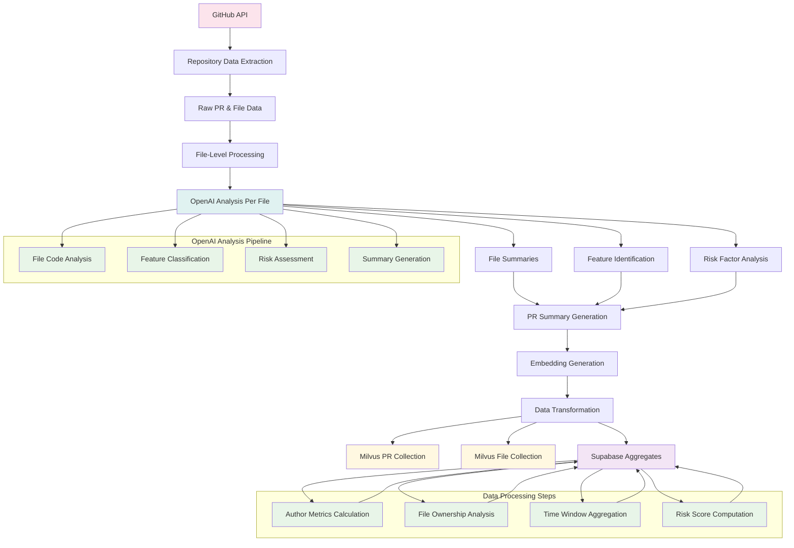
```mermaid
flowchart TD
    A[GitHub API] --> B[Repository Data Extraction]
    B --> C[Raw PR & File Data]
    C --> D[File-Level Processing]
    
    D --> E[OpenAI Analysis Per File]
    E --> F[File Summaries]
    E --> G[Feature Identification]
    E --> H[Risk Factor Analysis]
    
    F --> I[PR Summary Generation]
    G --> I
    H --> I
    
    I --> J[Embedding Generation]
    J --> K[Data Transformation]
    
    K --> L[Milvus PR Collection]
    K --> M[Milvus File Collection]
    K --> N[Supabase Aggregates]
    
    subgraph "OpenAI Analysis Pipeline"
        O[File Code Analysis]
        P[Feature Classification]
        Q[Risk Assessment]
        R[Summary Generation]
    end
    
    E --> O
    E --> P
    E --> Q
    E --> R
    
    subgraph "Data Processing Steps"
        S[Author Metrics Calculation]
        T[File Ownership Analysis]
        U[Time Window Aggregation]
        V[Risk Score Computation]
    end
    
    N --> S
    N --> T
    N --> U
    N --> V
    
    S --> N
    T --> N
    U --> N
    V --> N
    
    style A fill:#fce4ec
    style E fill:#e0f2f1
    style L fill:#fff8e1
    style M fill:#fff8e1
    style N fill:#f3e5f5
    style O fill:#e8f5e8
    style P fill:#e8f5e8
    style Q fill:#e8f5e8
    style R fill:#e8f5e8
    style S fill:#e8f5e8
    style T fill:#e8f5e8
    style U fill:#e8f5e8
    style V fill:#e8f5e8
```

### 2. Detailed ETL Process Flow

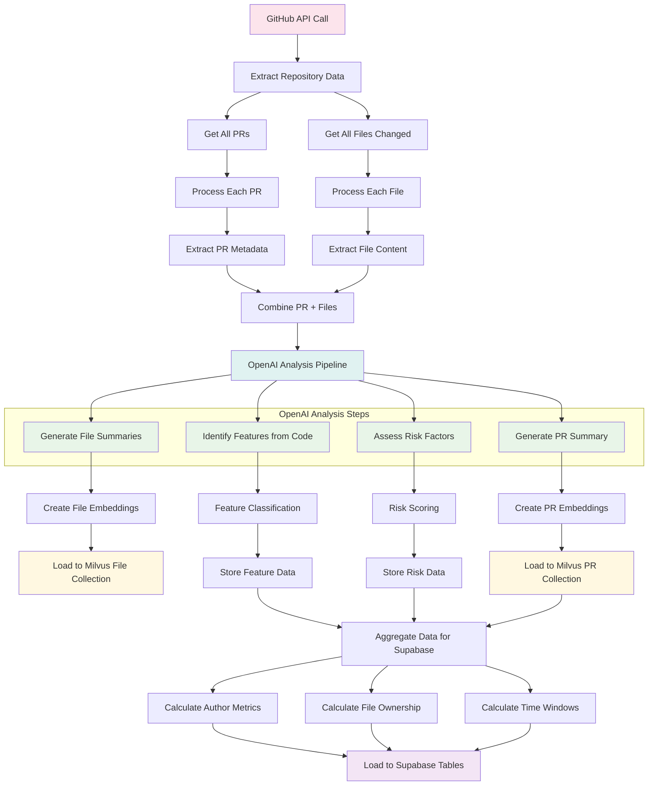
```mermaid
flowchart TD
    A[GitHub API Call] --> B[Extract Repository Data]
    B --> C[Get All PRs]
    B --> D[Get All Files Changed]
    
    C --> E[Process Each PR]
    D --> F[Process Each File]
    
    E --> G[Extract PR Metadata]
    F --> H[Extract File Content]
    
    G --> I[Combine PR + Files]
    H --> I
    
    I --> J[OpenAI Analysis Pipeline]
    
    subgraph "OpenAI Analysis Steps"
        K[Generate File Summaries]
        L[Identify Features from Code]
        M[Assess Risk Factors]
        N[Generate PR Summary]
    end
    
    J --> K
    J --> L
    J --> M
    J --> N
    
    K --> O[Create File Embeddings]
    L --> P[Feature Classification]
    M --> Q[Risk Scoring]
    N --> R[Create PR Embeddings]
    
    O --> S[Load to Milvus File Collection]
    P --> T[Store Feature Data]
    Q --> U[Store Risk Data]
    R --> V[Load to Milvus PR Collection]
    
    T --> W[Aggregate Data for Supabase]
    U --> W
    V --> W
    
    W --> X[Calculate Author Metrics]
    W --> Y[Calculate File Ownership]
    W --> Z[Calculate Time Windows]
    
    X --> AA[Load to Supabase Tables]
    Y --> AA
    Z --> AA
    
    style A fill:#fce4ec
    style J fill:#e0f2f1
    style S fill:#fff8e1
    style V fill:#fff8e1
    style AA fill:#f3e5f5
    style K fill:#e8f5e8
    style L fill:#e8f5e8
    style M fill:#e8f5e8
    style N fill:#e8f5e8
```

### 3. Query Processing Flow

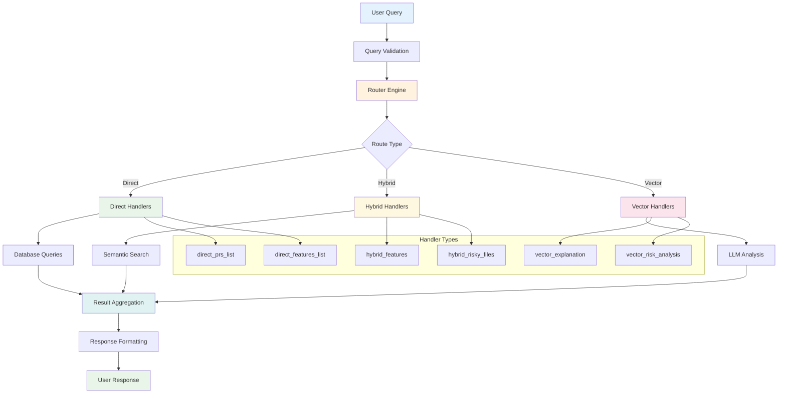
```mermaid
flowchart TD
    A[User Query] --> B[Query Validation]
    B --> C[Router Engine]
    C --> D{Route Type}
    
    D -->|Direct| E[Direct Handlers]
    D -->|Hybrid| F[Hybrid Handlers]
    D -->|Vector| G[Vector Handlers]
    
    E --> H[Database Queries]
    F --> I[Semantic Search]
    G --> J[LLM Analysis]
    
    H --> K[Result Aggregation]
    I --> K
    J --> K
    
    K --> L[Response Formatting]
    L --> M[User Response]
    
    subgraph "Handler Types"
        N[direct_prs_list]
        O[direct_features_list]
        P[hybrid_features]
        Q[hybrid_risky_files]
        R[vector_explanation]
        S[vector_risk_analysis]
    end
    
    E --> N
    E --> O
    F --> P
    F --> Q
    G --> R
    G --> S
    
    style A fill:#e3f2fd
    style C fill:#fff3e0
    style E fill:#e8f5e8
    style F fill:#fff8e1
    style G fill:#fce4ec
    style K fill:#e0f2f1
    style M fill:#e8f5e8
```

## Database Architecture

### 1. Supabase Schema Design

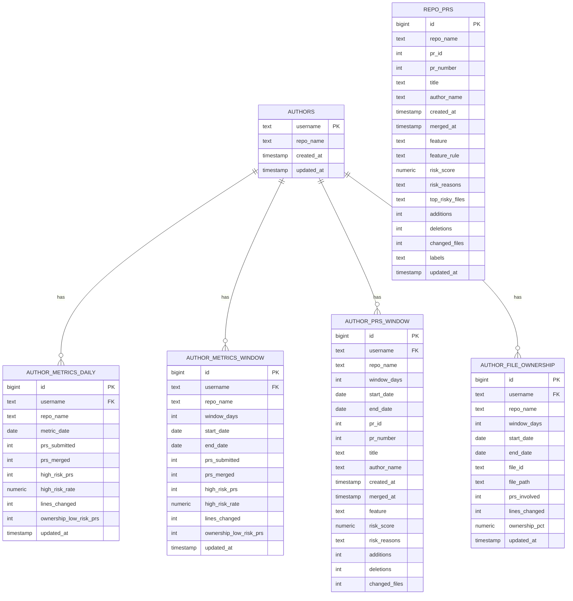
```mermaid
erDiagram
    AUTHORS {
        text username PK
        text repo_name
        timestamp created_at
        timestamp updated_at
    }
    
    AUTHOR_METRICS_DAILY {
        bigint id PK
        text username FK
        text repo_name
        date metric_date
        int prs_submitted
        int prs_merged
        int high_risk_prs
        numeric high_risk_rate
        int lines_changed
        int ownership_low_risk_prs
        timestamp updated_at
    }
    
    AUTHOR_METRICS_WINDOW {
        bigint id PK
        text username FK
        text repo_name
        int window_days
        date start_date
        date end_date
        int prs_submitted
        int prs_merged
        int high_risk_prs
        numeric high_risk_rate
        int lines_changed
        int ownership_low_risk_prs
        timestamp updated_at
    }
    
    AUTHOR_PRS_WINDOW {
        bigint id PK
        text username FK
        text repo_name
        int window_days
        date start_date
        date end_date
        int pr_id
        int pr_number
        text title
        text author_name
        timestamp created_at
        timestamp merged_at
        text feature
        numeric risk_score
        text risk_reasons
        int additions
        int deletions
        int changed_files
    }
    
    AUTHOR_FILE_OWNERSHIP {
        bigint id PK
        text username FK
        text repo_name
        int window_days
        date start_date
        date end_date
        text file_id
        text file_path
        int prs_involved
        int lines_changed
        numeric ownership_pct
        timestamp updated_at
    }
    
    REPO_PRS {
        bigint id PK
        text repo_name
        int pr_id
        int pr_number
        text title
        text author_name
        timestamp created_at
        timestamp merged_at
        text feature
        text feature_rule
        numeric risk_score
        text risk_reasons
        text top_risky_files
        int additions
        int deletions
        int changed_files
        text labels
        timestamp updated_at
    }
    
    AUTHORS ||--o{ AUTHOR_METRICS_DAILY : "has"
    AUTHORS ||--o{ AUTHOR_METRICS_WINDOW : "has"
    AUTHORS ||--o{ AUTHOR_PRS_WINDOW : "has"
    AUTHORS ||--o{ AUTHOR_FILE_OWNERSHIP : "has"
```

### 2. Milvus Vector Database Schema

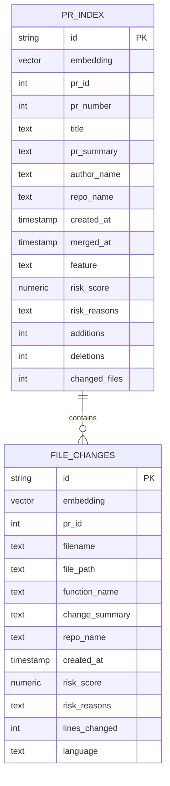
```mermaid
erDiagram
    PR_INDEX {
        string id PK
        vector embedding
        int pr_id
        int pr_number
        text title
        text pr_summary
        text author_name
        text repo_name
        timestamp created_at
        timestamp merged_at
        text feature
        numeric risk_score
        text risk_reasons
        int additions
        int deletions
        int changed_files
    }
    
    FILE_CHANGES {
        string id PK
        vector embedding
        int pr_id
        text filename
        text file_path
        text function_name
        text change_summary
        text repo_name
        timestamp created_at
        numeric risk_score
        text risk_reasons
        int lines_changed
        text language
    }
    
    PR_INDEX ||--o{ FILE_CHANGES : "contains"
```

## AI Analysis Pipeline Architecture

### 1. OpenAI Integration Flow

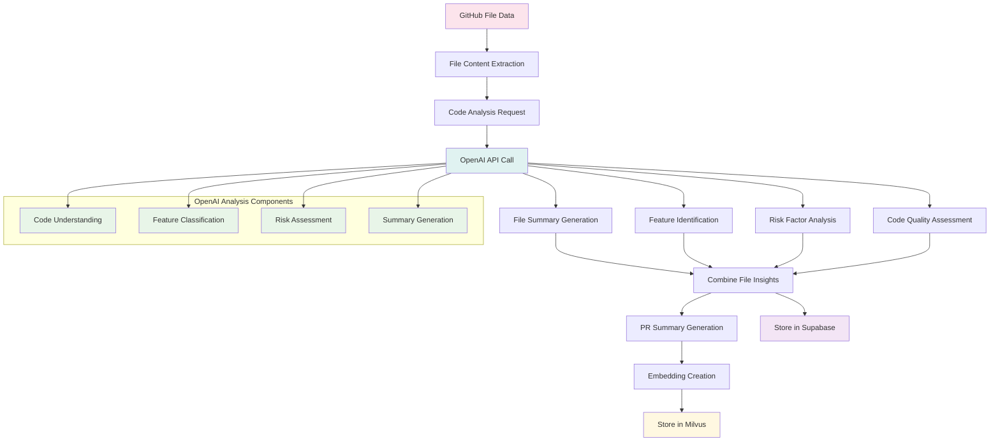
```mermaid
flowchart TD
    A[GitHub File Data] --> B[File Content Extraction]
    B --> C[Code Analysis Request]
    C --> D[OpenAI API Call]
    
    D --> E[File Summary Generation]
    D --> F[Feature Identification]
    D --> G[Risk Factor Analysis]
    D --> H[Code Quality Assessment]
    
    E --> I[Combine File Insights]
    F --> I
    G --> I
    H --> I
    
    I --> J[PR Summary Generation]
    J --> K[Embedding Creation]
    
    K --> L[Store in Milvus]
    I --> M[Store in Supabase]
    
    subgraph "OpenAI Analysis Components"
        N[Code Understanding]
        O[Feature Classification]
        P[Risk Assessment]
        Q[Summary Generation]
    end
    
    D --> N
    D --> O
    D --> P
    D --> Q
    
    style A fill:#fce4ec
    style D fill:#e0f2f1
    style L fill:#fff8e1
    style M fill:#f3e5f5
    style N fill:#e8f5e8
    style O fill:#e8f5e8
    style P fill:#e8f5e8
    style Q fill:#e8f5e8
```

### 2. Data Processing Pipeline

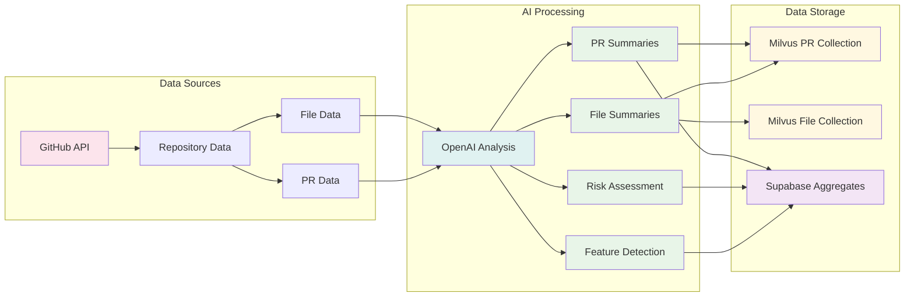
```mermaid
flowchart LR
    subgraph "Data Sources"
        A[GitHub API]
        B[Repository Data]
        C[PR Data]
        D[File Data]
    end
    
    subgraph "AI Processing"
        E[OpenAI Analysis]
        F[File Summaries]
        G[Feature Detection]
        H[Risk Assessment]
        I[PR Summaries]
    end
    
    subgraph "Data Storage"
        J[Milvus PR Collection]
        K[Milvus File Collection]
        L[Supabase Aggregates]
    end
    
    A --> B
    B --> C
    B --> D
    
    C --> E
    D --> E
    
    E --> F
    E --> G
    E --> H
    E --> I
    
    F --> J
    F --> K
    G --> L
    H --> L
    I --> J
    I --> L
    
    style A fill:#fce4ec
    style E fill:#e0f2f1
    style J fill:#fff8e1
    style K fill:#fff8e1
    style L fill:#f3e5f5
    style F fill:#e8f5e8
    style G fill:#e8f5e8
    style H fill:#e8f5e8
    style I fill:#e8f5e8
```

## Deployment Architecture

### 1. Railway Deployment

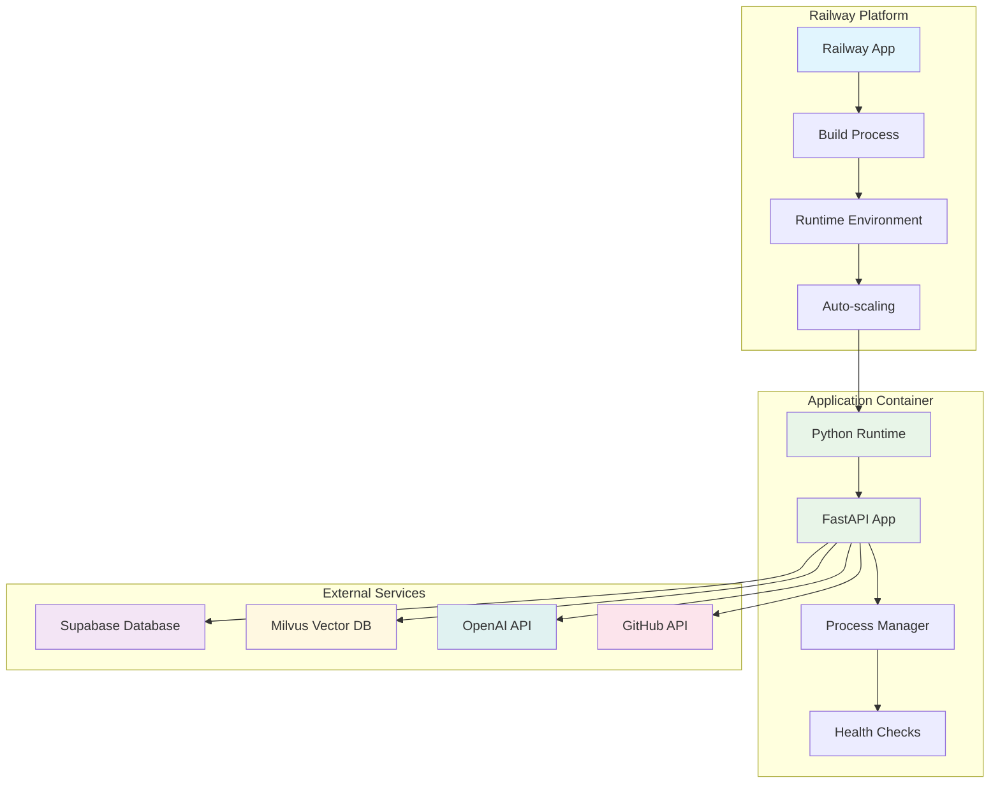
```mermaid
graph TB
    subgraph "Railway Platform"
        A[Railway App]
        B[Build Process]
        C[Runtime Environment]
        D[Auto-scaling]
    end
    
    subgraph "Application Container"
        E[Python Runtime]
        F[FastAPI App]
        G[Process Manager]
        H[Health Checks]
    end
    
    subgraph "External Services"
        I[Supabase Database]
        J[Milvus Vector DB]
        K[OpenAI API]
        L[GitHub API]
    end
    
    A --> B
    B --> C
    C --> D
    D --> E
    E --> F
    F --> G
    G --> H
    
    F --> I
    F --> J
    F --> K
    F --> L
    
    style A fill:#e1f5fe
    style E fill:#e8f5e8
    style F fill:#e8f5e8
    style I fill:#f3e5f5
    style J fill:#fff8e1
    style K fill:#e0f2f1
    style L fill:#fce4ec
```

### 2. Environment Configuration

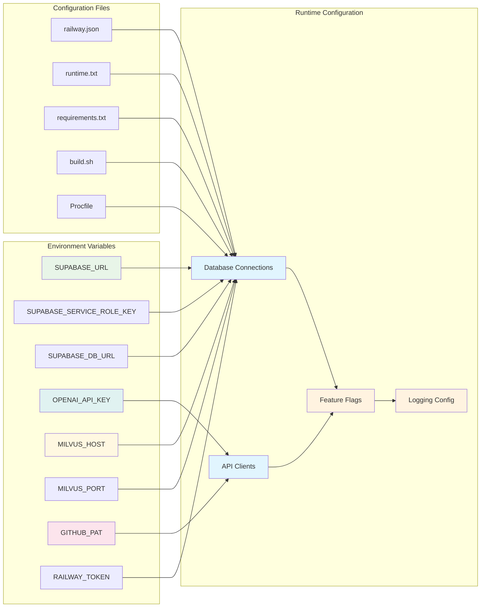
```mermaid
graph LR
    subgraph "Environment Variables"
        A[SUPABASE_URL]
        B[SUPABASE_SERVICE_ROLE_KEY]
        C[SUPABASE_DB_URL]
        D[OPENAI_API_KEY]
        E[MILVUS_HOST]
        F[MILVUS_PORT]
        G[GITHUB_PAT]
        H[RAILWAY_TOKEN]
    end
    
    subgraph "Configuration Files"
        I[railway.json]
        J[runtime.txt]
        K[requirements.txt]
        L[build.sh]
        M[Procfile]
    end
    
    subgraph "Runtime Configuration"
        N[Database Connections]
        O[API Clients]
        P[Feature Flags]
        Q[Logging Config]
    end
    
    A --> N
    B --> N
    C --> N
    D --> O
    E --> N
    F --> N
    G --> O
    H --> N
    
    I --> N
    J --> N
    K --> N
    L --> N
    M --> N
    
    N --> P
    O --> P
    P --> Q
    
    style A fill:#e8f5e8
    style D fill:#e0f2f1
    style E fill:#fff8e1
    style G fill:#fce4ec
    style N fill:#e1f5fe
    style O fill:#e1f5fe
    style P fill:#fff3e0
    style Q fill:#fff3e0
```

## Security Architecture

### 1. Authentication & Authorization

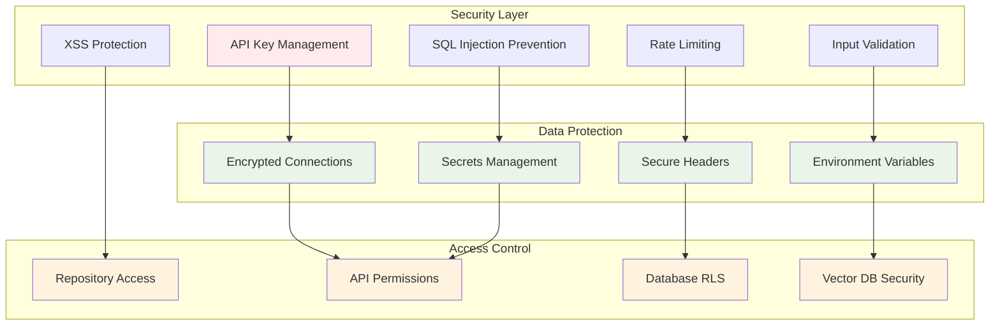
```mermaid
graph TB
    subgraph "Security Layer"
        A[API Key Management]
        B[Rate Limiting]
        C[Input Validation]
        D[SQL Injection Prevention]
        E[XSS Protection]
    end
    
    subgraph "Data Protection"
        F[Encrypted Connections]
        G[Secure Headers]
        H[Environment Variables]
        I[Secrets Management]
    end
    
    subgraph "Access Control"
        J[Repository Access]
        K[API Permissions]
        L[Database RLS]
        M[Vector DB Security]
    end
    
    A --> F
    B --> G
    C --> H
    D --> I
    E --> J
    
    F --> K
    G --> L
    H --> M
    I --> K
    
    style A fill:#ffebee
    style F fill:#e8f5e8
    style G fill:#e8f5e8
    style H fill:#e8f5e8
    style I fill:#e8f5e8
    style J fill:#fff3e0
    style K fill:#fff3e0
    style L fill:#fff3e0
    style M fill:#fff3e0
```

## Performance Architecture

### 1. Caching Strategy

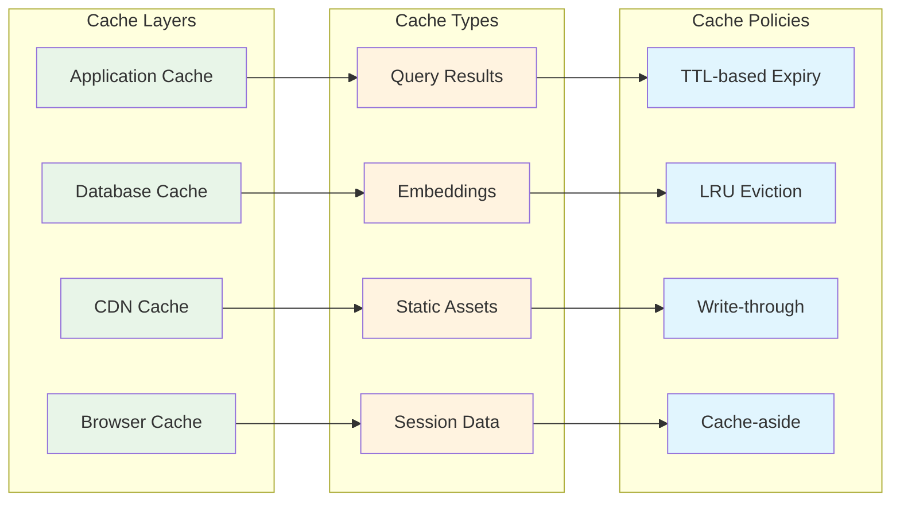
```mermaid
graph LR
    subgraph "Cache Layers"
        A[Application Cache]
        B[Database Cache]
        C[CDN Cache]
        D[Browser Cache]
    end
    
    subgraph "Cache Types"
        E[Query Results]
        F[Embeddings]
        G[Static Assets]
        H[Session Data]
    end
    
    subgraph "Cache Policies"
        I[TTL-based Expiry]
        J[LRU Eviction]
        K[Write-through]
        L[Cache-aside]
    end
    
    A --> E
    B --> F
    C --> G
    D --> H
    
    E --> I
    F --> J
    G --> K
    H --> L
    
    style A fill:#e8f5e8
    style B fill:#e8f5e8
    style C fill:#e8f5e8
    style D fill:#e8f5e8
    style E fill:#fff3e0
    style F fill:#fff3e0
    style G fill:#fff3e0
    style H fill:#fff3e0
    style I fill:#e1f5fe
    style J fill:#e1f5fe
    style K fill:#e1f5fe
    style L fill:#e1f5fe
```

### 2. Scalability Design

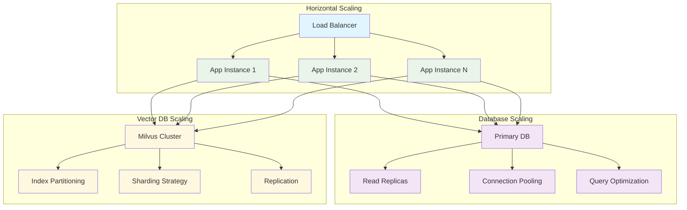
```mermaid
graph TB
    subgraph "Horizontal Scaling"
        A[Load Balancer]
        B[App Instance 1]
        C[App Instance 2]
        D[App Instance N]
    end
    
    subgraph "Database Scaling"
        E[Primary DB]
        F[Read Replicas]
        G[Connection Pooling]
        H[Query Optimization]
    end
    
    subgraph "Vector DB Scaling"
        I[Milvus Cluster]
        J[Index Partitioning]
        K[Sharding Strategy]
        L[Replication]
    end
    
    A --> B
    A --> C
    A --> D
    
    B --> E
    C --> E
    D --> E
    
    E --> F
    E --> G
    E --> H
    
    B --> I
    C --> I
    D --> I
    
    I --> J
    I --> K
    I --> L
    
    style A fill:#e1f5fe
    style B fill:#e8f5e8
    style C fill:#e8f5e8
    style D fill:#e8f5e8
    style E fill:#f3e5f5
    style F fill:#f3e5f5
    style G fill:#f3e5f5
    style H fill:#f3e5f5
    style I fill:#fff8e1
    style J fill:#fff8e1
    style K fill:#fff8e1
    style L fill:#fff8e1
```

## Monitoring & Observability

### 1. Logging Architecture

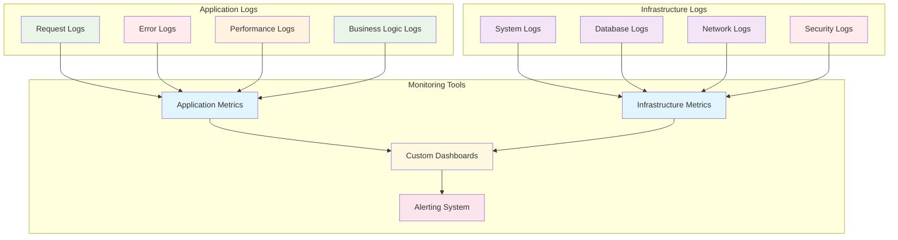
```mermaid
graph TB
    subgraph "Application Logs"
        A[Request Logs]
        B[Error Logs]
        C[Performance Logs]
        D[Business Logic Logs]
    end
    
    subgraph "Infrastructure Logs"
        E[System Logs]
        F[Database Logs]
        G[Network Logs]
        H[Security Logs]
    end
    
    subgraph "Monitoring Tools"
        I[Application Metrics]
        J[Infrastructure Metrics]
        K[Custom Dashboards]
        L[Alerting System]
    end
    
    A --> I
    B --> I
    C --> I
    D --> I
    
    E --> J
    F --> J
    G --> J
    H --> J
    
    I --> K
    J --> K
    K --> L
    
    style A fill:#e8f5e8
    style B fill:#ffebee
    style C fill:#fff3e0
    style D fill:#e8f5e8
    style E fill:#f3e5f5
    style F fill:#f3e5f5
    style G fill:#f3e5f5
    style H fill:#ffebee
    style I fill:#e1f5fe
    style J fill:#e1f5fe
    style K fill:#fff8e1
    style L fill:#fce4ec
```

## Data Pipeline Architecture

### 1. ETL Process Flow (Updated)

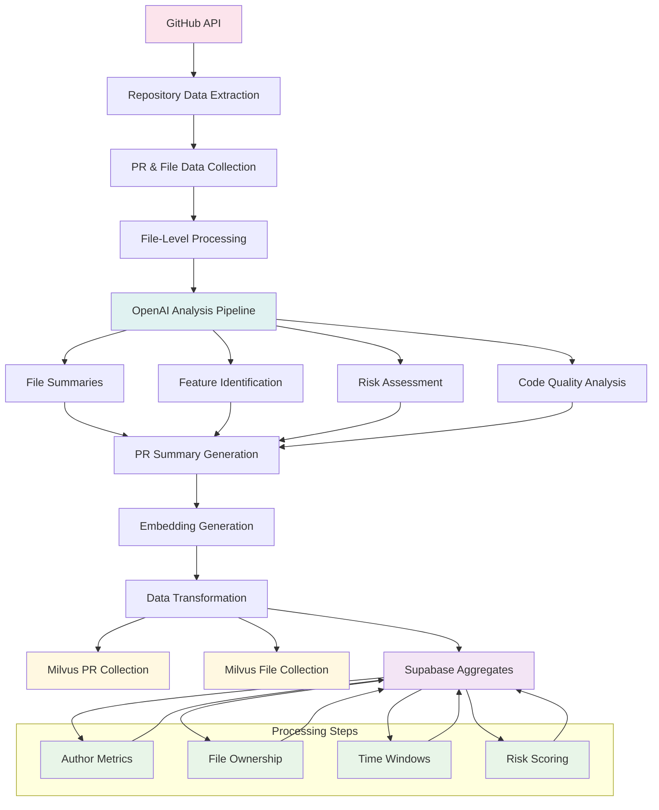
```mermaid
flowchart TD
    A[GitHub API] --> B[Repository Data Extraction]
    B --> C[PR & File Data Collection]
    C --> D[File-Level Processing]
    
    D --> E[OpenAI Analysis Pipeline]
    E --> F[File Summaries]
    E --> G[Feature Identification]
    E --> H[Risk Assessment]
    E --> I[Code Quality Analysis]
    
    F --> J[PR Summary Generation]
    G --> J
    H --> J
    I --> J
    
    J --> K[Embedding Generation]
    K --> L[Data Transformation]
    
    L --> M[Milvus PR Collection]
    L --> N[Milvus File Collection]
    L --> O[Supabase Aggregates]
    
    subgraph "Processing Steps"
        P[Author Metrics]
        Q[File Ownership]
        R[Time Windows]
        S[Risk Scoring]
    end
    
    O --> P
    O --> Q
    O --> R
    O --> S
    
    P --> O
    Q --> O
    R --> O
    S --> O
    
    style A fill:#fce4ec
    style E fill:#e0f2f1
    style M fill:#fff8e1
    style N fill:#fff8e1
    style O fill:#f3e5f5
    style P fill:#e8f5e8
    style Q fill:#e8f5e8
    style R fill:#e8f5e8
    style S fill:#e8f5e8
```

## Integration Architecture

### 1. External Service Integration

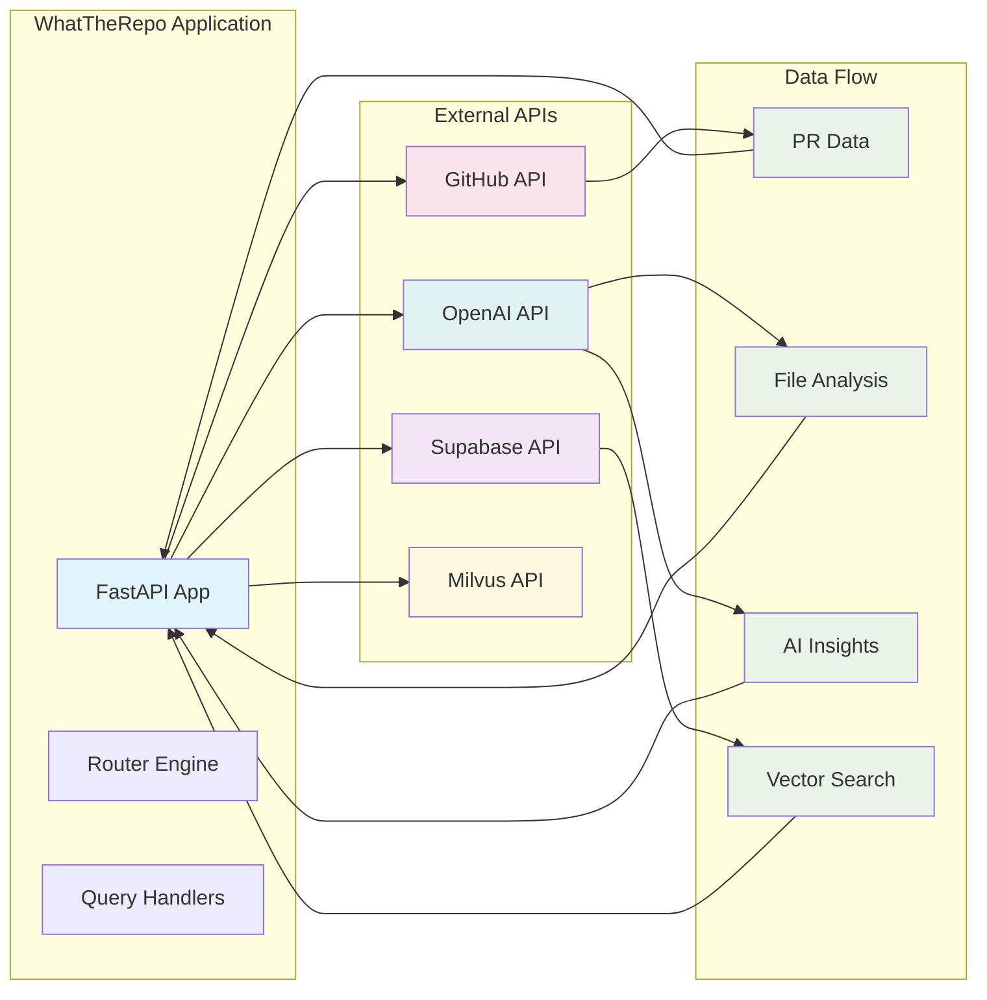
```mermaid
graph LR
    subgraph "WhatTheRepo Application"
        A[FastAPI App]
        B[Router Engine]
        C[Query Handlers]
    end
    
    subgraph "External APIs"
        D[GitHub API]
        E[OpenAI API]
        F[Supabase API]
        G[Milvus API]
    end
    
    subgraph "Data Flow"
        H[PR Data]
        I[File Analysis]
        J[AI Insights]
        K[Vector Search]
    end
    
    A --> D
    A --> E
    A --> F
    A --> G
    
    D --> H
    E --> I
    E --> J
    F --> K
    
    H --> A
    I --> A
    J --> A
    K --> A
    
    style A fill:#e1f5fe
    style D fill:#fce4ec
    style E fill:#e0f2f1
    style F fill:#f3e5f5
    style G fill:#fff8e1
    style H fill:#e8f5e8
    style I fill:#e8f5e8
    style J fill:#e8f5e8
    style K fill:#e8f5e8
```

## Technology Stack

### 1. Backend Stack

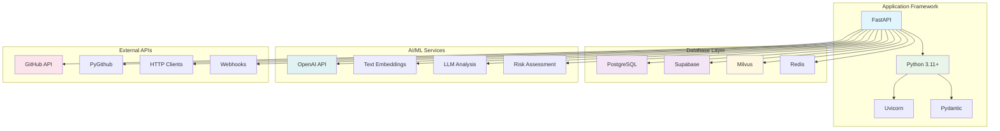
```mermaid
graph TB
    subgraph "Application Framework"
        A[FastAPI]
        B[Python 3.11+]
        C[Uvicorn]
        D[Pydantic]
    end
    
    subgraph "Database Layer"
        E[PostgreSQL]
        F[Supabase]
        G[Milvus]
        H[Redis]
    end
    
    subgraph "AI/ML Services"
        I[OpenAI API]
        J[Text Embeddings]
        K[LLM Analysis]
        L[Risk Assessment]
    end
    
    subgraph "External APIs"
        M[GitHub API]
        N[PyGithub]
        O[HTTP Clients]
        P[Webhooks]
    end
    
    A --> B
    B --> C
    B --> D
    
    A --> E
    A --> F
    A --> G
    A --> H
    
    A --> I
    A --> J
    A --> K
    A --> L
    
    A --> M
    A --> N
    A --> O
    A --> P
    
    style A fill:#e1f5fe
    style B fill:#e8f5e8
    style E fill:#f3e5f5
    style F fill:#f3e5f5
    style G fill:#fff8e1
    style I fill:#e0f2f1
    style M fill:#fce4ec
```

### 2. Frontend Stack

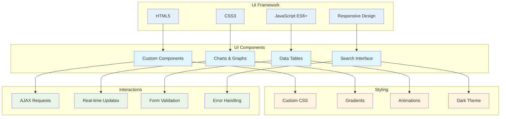
```mermaid
graph TB
    subgraph "UI Framework"
        A[HTML5]
        B[CSS3]
        C[JavaScript ES6+]
        D[Responsive Design]
    end
    
    subgraph "UI Components"
        E[Custom Components]
        F[Charts & Graphs]
        G[Data Tables]
        H[Search Interface]
    end
    
    subgraph "Styling"
        I[Custom CSS]
        J[Gradients]
        K[Animations]
        L[Dark Theme]
    end
    
    subgraph "Interactions"
        M[AJAX Requests]
        N[Real-time Updates]
        O[Form Validation]
        P[Error Handling]
    end
    
    A --> E
    B --> F
    C --> G
    D --> H
    
    E --> I
    F --> J
    G --> K
    H --> L
    
    E --> M
    F --> N
    G --> O
    H --> P
    
    style A fill:#e3f2fd
    style B fill:#e3f2fd
    style C fill:#e3f2fd
    style D fill:#e3f2fd
    style E fill:#e1f5fe
    style F fill:#e1f5fe
    style G fill:#e1f5fe
    style H fill:#e1f5fe
    style I fill:#fff3e0
    style J fill:#fff3e0
    style K fill:#fff3e0
    style L fill:#fff3e0
    style M fill:#e8f5e8
    style N fill:#e8f5e8
    style O fill:#e8f5e8
    style P fill:#e8f5e8
```

## Conclusion

This updated system architecture provides a robust, scalable, and maintainable foundation for the WhatTheRepo application. The key improvement is the detailed ETL flow where GitHub API extraction triggers OpenAI analysis at file level, generating comprehensive insights that flow to both Milvus vector collections and Supabase for aggregated data.

Key architectural principles include:
- **Separation of Concerns**: Clear boundaries between different system layers
- **Scalability**: Horizontal scaling capabilities for both application and data layers
- **Security**: Multi-layered security approach with proper authentication and authorization
- **Observability**: Comprehensive logging and monitoring for operational excellence
- **Performance**: Optimized data flow with caching and efficient query processing
- **Maintainability**: Clean code structure with proper documentation and testing
- **AI Integration**: Seamless OpenAI integration for intelligent analysis and insights
